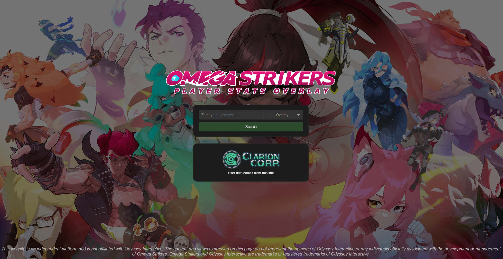
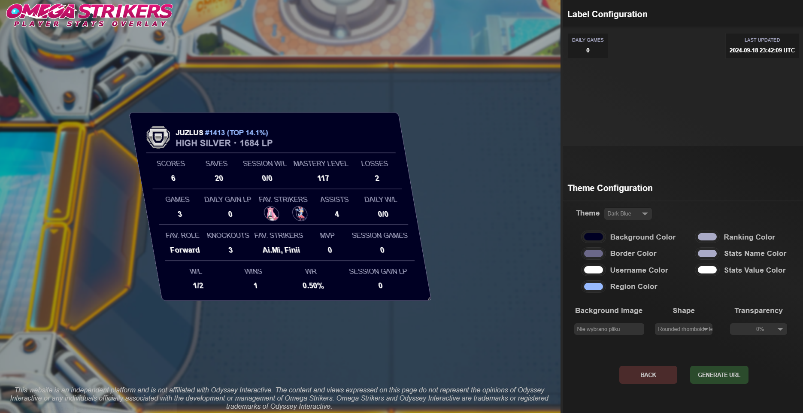
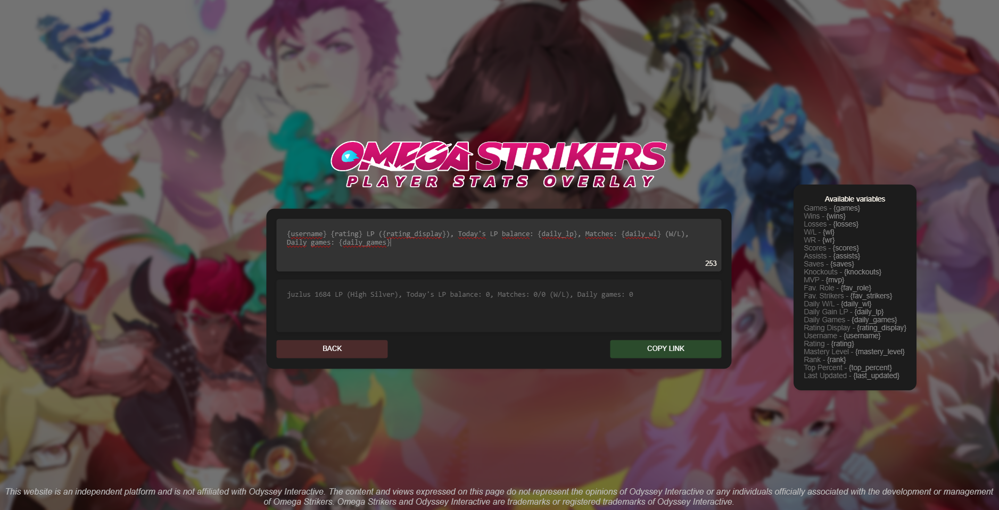
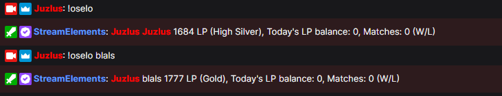

# About

The Omega Strikers User Stats Overlay is a web page that utilizes the ~~Strikr.gg [*]~~ [Clarioncorp.net API](https://docs.clarioncorp.net) to fetch user information and generate an interactive overlay. This overlay displays real-time user statistics, specifically designed for streaming purposes.

## Usage

Go to the [Omega Strikers User Stats Overlay](https://juzlus.github.io/omega-strikers-overlay/) page, then enter your in-game nickname and select the corresponding region.

To create your own command, visit this [StreamElements website](https://streamelements.com/dashboard/bot/commands/custom).

_This page exclusively presents ranked statistics for the top **10,000** players from each region._
## Screenshots

## Feedback

If you have any Feedback or questions, please contact me at juzlus.biznes@gmail.com or [Discord](https://discordapp.com/users/284780352042434570).

## Donate

  
  <a>⠀</a>
  

## Disclaimer

_The Omega Strikers User Stats Overlay is an independent project developed by an individual and is not endorsed or affiliated with [Clarioncorp.net](https://clarioncorp.net) or [Odyssey Interactive](https://www.odysseyinteractive.gg). This website utilizes publicly available APIs or web scraping techniques to retrieve user information from [Clarioncorp.net](https://clarioncorp.net). The content and views expressed on this page are solely those of the individual maintaining the overlay and do not reflect the opinions or official stance of Odyssey Interactive or any individuals associated with the development or management of Omega Strikers. Omega Strikers and Odyssey Interactive are trademarks or registered trademarks of Odyssey Interactive._

